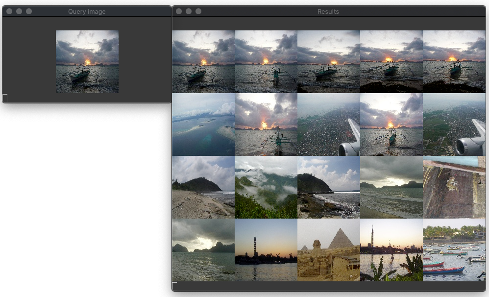

CBIR with Wavelet features
==========================
Implementation of the content based image retrieval algorithm described in
James Ze Wang, Gio Wiederhold, Oscar Firschein, and Sha Xin Wei, 1998.



Dataset
=======
The images can be downloaded from [INRIA Holidays dataset](http://lear.inrialpes.fr/people/jegou/data.php).

Usage
=====
```
usage: wbiis [-h] {index,search} ...

optional arguments:
  -h, --help      show this help message and exit

subcommands:
  {index,search}
    index         index images
    search        search images
```

References
==========
James Ze Wang, Gio Wiederhold, Oscar Firschein, and Sha Xin Wei.
Content-based image indexing and searching using daubechies’ wavelets.
International Journal on Digital Libraries, 1(4):311–328, 1998.
